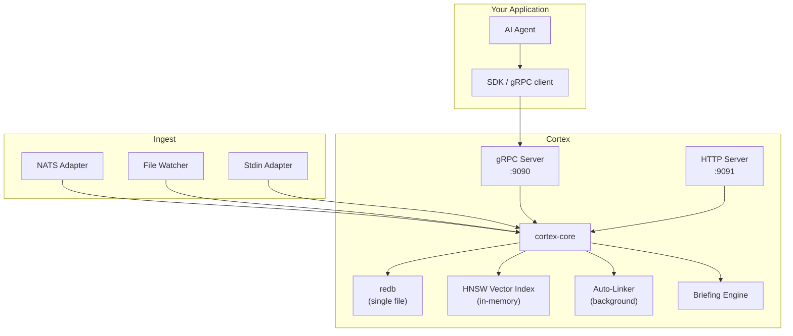
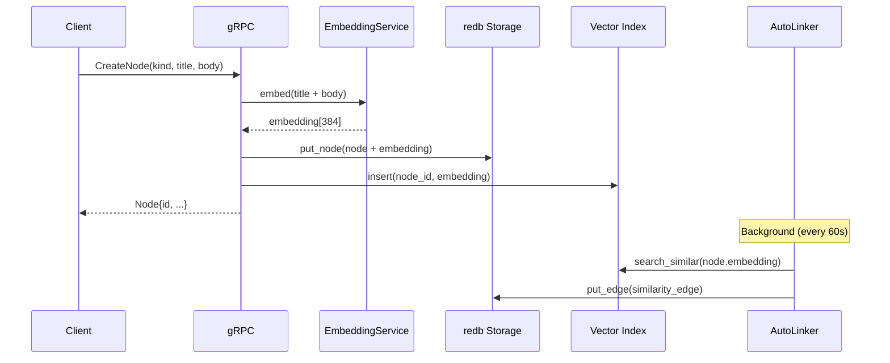

# Architecture

Cortex is a Rust monorepo structured as a multi-crate workspace. The main components are:

- **cortex-core** — The core library. All logic lives here.
- **cortex-server** — The server binary and CLI. Thin shell around cortex-core.
- **cortex-proto** — Protobuf definitions for the gRPC API.
- **cortex-client** — Rust client SDK.

## High-Level System

## Node Creation Flow

## Storage

Cortex uses [redb](https://github.com/cberner/redb), a transactional embedded key-value database written in Rust. All data lives in a single `.redb` file. No separate database process, no network, no config.

The database contains three primary tables:
- **nodes** — keyed by `NodeId` (UUID v7), values are bincode-serialised `Node` structs
- **edges** — keyed by `EdgeId`, values are bincode-serialised `Edge` structs
- **meta** — key-value metadata (schema version, etc.)

## Vector Index

HNSW (Hierarchical Navigable Small World) index via the `instant-distance` crate. Built in-memory at startup from embeddings stored in the node table. Insertions are synchronised via an `Arc<RwLock<HnswIndex>>`.

Embeddings are generated locally using [FastEmbed](https://github.com/Anush008/fastembed-rs) (BAAI/bge-small-en-v1.5, 384 dimensions). No external API calls required.

## Auto-Linker

The auto-linker runs as a background Tokio task. Each cycle:

1. Picks up nodes from the backlog (newly created or modified nodes)
2. For each node, searches the HNSW index for similar nodes (cosine similarity)
3. Creates `similar_to` edges for pairs above the similarity threshold
4. Runs the dedup scanner to remove redundant edges
5. Applies contradiction detection rules

## Briefing Engine

The briefing engine generates context documents on demand for a given agent. It runs a series of sections in order:

1. **Patterns** — frequently observed patterns from the graph
2. **Goals** — active goal nodes for the agent
3. **Unresolved** — knowledge marked as unresolved or contradicted
4. **Active Context** — recent nodes touching the agent, ranked by importance x recency

Each section uses a `seen_ids` set to avoid repeating content across sections.

## Encryption

When `CORTEX_ENCRYPTION_KEY` is set, the database file is encrypted at rest using AES-256-GCM. Cortex decrypts to a temporary file on startup and re-encrypts on shutdown.

## Audit Log

Every mutation (node create/update/delete, edge create) is recorded in a redb audit table, keyed by nanosecond timestamp. Query with `cortex audit`.
