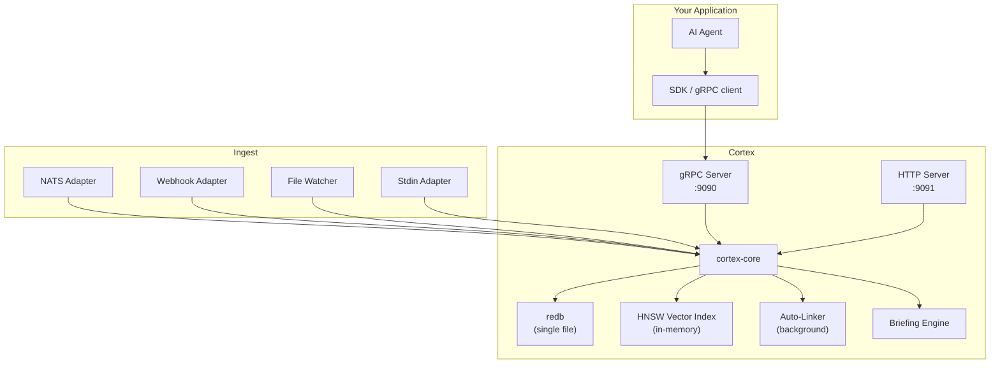
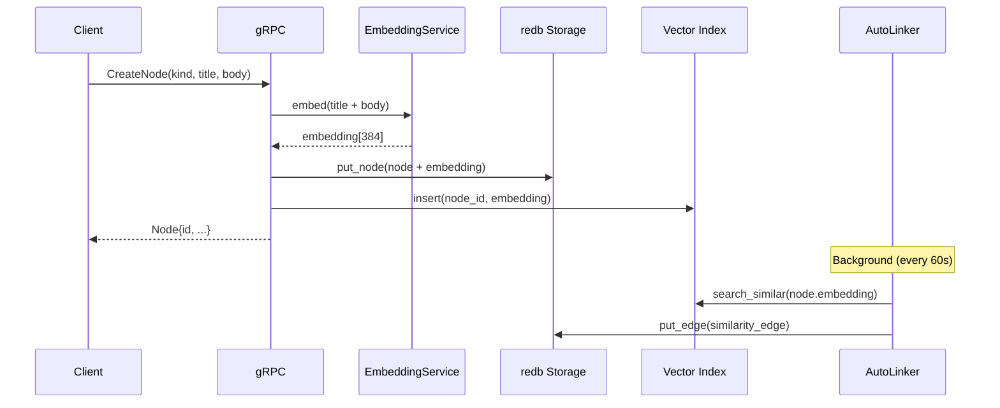

# Phase 7H: Documentation & Launch

**Status:** Ready to begin content drafting after Phase 7A is merged. Full execution requires all other phases to be code-complete.  
**Dependencies:** Phase 7A (Core Decoupling) for accurate API references. All other phases for their respective docs sections.  
**Weeks:** 11–12  

---

## Overview

Public launch of Cortex as an open-source standalone product. This phase covers: rewriting the README for a public audience, building a full documentation site, architecture diagrams, integration guides for major agent frameworks (LangChain, CrewAI, OpenClaw), a graph visualisation SPA, packaging and publishing (crates.io, Docker Hub, Homebrew, pip, npm), MIT licensing, CONTRIBUTING.md, a launch blog post, and coordinated HN/Reddit/X/LinkedIn announcement.

---

## Documentation Site Structure

All docs live in `docs/` at the repository root.

```
docs/
├── getting-started/
│   ├── quickstart.md          # 5-minute setup
│   ├── installation.md        # All platforms (cargo, Docker, Homebrew)
│   ├── first-agent.md         # Build a simple agent with Cortex memory
│   └── configuration.md       # cortex.toml complete reference
├── concepts/
│   ├── architecture.md        # How Cortex works internally
│   ├── graph-model.md         # Nodes, edges, kinds, relations
│   ├── auto-linker.md         # How relationships are discovered
│   ├── briefings.md           # How context synthesis works
│   ├── decay-and-memory.md    # How knowledge ages
│   └── hybrid-search.md       # Vector + graph retrieval
├── guides/
│   ├── langchain.md           # LangChain integration
│   ├── crewai.md              # CrewAI integration
│   ├── openclaw.md            # OpenClaw integration
│   ├── multi-agent.md         # Shared memory for agent teams
│   ├── production.md          # Running in production
│   └── migration.md           # Migrating from other memory solutions
├── reference/
│   ├── cli.md                 # CLI command reference
│   ├── grpc-api.md            # gRPC API reference
│   ├── http-api.md            # HTTP API reference
│   ├── python-sdk.md          # Python SDK reference
│   ├── typescript-sdk.md      # TypeScript SDK reference
│   ├── go-sdk.md              # Go SDK reference
│   ├── rust-sdk.md            # Rust library reference
│   └── config.md              # cortex.toml configuration reference
├── contributing/
│   ├── CONTRIBUTING.md        # How to contribute
│   ├── development.md         # Dev setup, running tests
│   ├── architecture.md        # Internal architecture for contributors
└── blog/
    └── why-we-built-cortex.md # Launch blog post
```

---

## Task 1: README Rewrite (Public Audience)

### File: `README.md` (root of cortex repo)

The current README is written for internal Warren use. This rewrites it for public open-source audiences.

```markdown
# Cortex

**Embedded graph memory for AI agents. One binary. One file. Zero dependencies.**

Cortex is a local knowledge graph that stores what your AI agents know,
automatically discovers relationships between knowledge, and synthesises
context briefings on demand. Think SQLite, but for agent memory.

## Why Cortex?

Your agent's memory shouldn't be a text file. It should be a living graph
that wires itself, forgets what's irrelevant, and tells your agent exactly
what it needs to know.

- **Graph-native** — typed nodes and edges, not just vectors
- **Auto-linking** — relationships discovered via embedding similarity
- **Decay** — unused knowledge fades, important knowledge persists
- **Briefings** — "what do I need to know?" → tailored context document
- **Hybrid search** — vector similarity × graph proximity
- **Embedded** — single file, no external dependencies
- **Fast** — Rust, HNSW index, mmap'd storage

## Quick Start

### Install

```bash
# macOS
brew install cortex-memory

# Cargo
cargo install cortex-memory

# Docker
docker run -p 9090:9090 -p 9091:9091 mikesquared/cortex:latest
```

### 5 Minutes to Memory

```bash
# Create a project
cortex init

# Start the server
cortex serve

# Store some knowledge
cortex node create --kind fact --title "The API uses JWT auth" --importance 0.7

# Search
cortex search "authentication"

# Get a briefing for your agent
cortex briefing my-agent
```

### As a Library (Python)

```python
from cortex_memory import Cortex

cx = Cortex("localhost:9090")
cx.store("decision", "Use FastAPI", body="Async + type hints", importance=0.8)

results = cx.search("backend framework")
print(cx.briefing("my-agent"))
```

### Embedded in Rust

```rust
use cortex_core::{Cortex, Config};

let cx = Cortex::open("./memory.redb", Config::default())?;
cx.store(Node::fact("The API uses JWT auth", 0.7))?;
let results = cx.search("authentication", 5)?;
```

## Documentation

- **[Quick Start](https://docs.cortex.dev/getting-started/quickstart)**
- **[Configuration Reference](https://docs.cortex.dev/reference/config)**
- **[Python SDK](https://docs.cortex.dev/reference/python-sdk)**
- **[gRPC API](https://docs.cortex.dev/reference/grpc-api)**

## Why Not Vector DB?

| Feature | Cortex | Mem0 | Zep | Chroma | pgvector |
|---------|--------|------|-----|--------|----------|
| Embedded (no server) | ✅ | ❌ | ❌ | ✅ | ❌ |
| Graph relationships | ✅ native | ❌ | ❌ | ❌ | ❌ |
| Auto-linking | ✅ | ❌ | ❌ | ❌ | ❌ |
| Edge decay | ✅ | ❌ | ❌ | ❌ | ❌ |
| Contradiction detection | ✅ | ❌ | ❌ | ❌ | ❌ |
| Briefing synthesis | ✅ | ❌ | ❌ | ❌ | ❌ |
| Hybrid search (vector+graph) | ✅ | ❌ | ❌ | ❌ | ❌ |
| Local embeddings | ✅ | ❌ | ❌ | ✅ | ❌ |
| Single binary | ✅ | ❌ | ❌ | ❌ | ❌ |

**Our moat:** Graph-native memory with auto-linking and decay. Nobody else does this.

## Contributing

See [CONTRIBUTING.md](CONTRIBUTING.md). Contributions welcome!

## License

MIT — see [LICENSE](LICENSE).
```

---

## Task 2: Architecture Diagrams

### File: `docs/concepts/architecture.md`

This document includes Mermaid diagrams rendered by the docs site.

**High-level architecture diagram:**



**Data flow diagram (node creation):**



---

## Task 3: Getting Started Docs

### File: `docs/getting-started/quickstart.md`

```markdown
# Quick Start — 5 Minutes to Memory

This guide gets you from zero to a working Cortex instance in 5 minutes.

## 1. Install

### macOS (Homebrew)
```bash
brew install cortex-memory
```

### Linux / macOS (cargo)
```bash
cargo install cortex-memory
```

### Docker
```bash
docker pull mikesquared/cortex:latest
```

## 2. Initialise

```bash
mkdir my-project && cd my-project
cortex init
```

Answer the prompts — the defaults work fine for getting started.

## 3. Start

```bash
cortex serve
# Cortex is now running at localhost:9090 (gRPC) and localhost:9091 (HTTP)
```

## 4. Store Knowledge

```bash
cortex node create \
  --kind fact \
  --title "The API uses JWT authentication" \
  --importance 0.7
```

## 5. Search

```bash
cortex search "authentication"
# 1. 0.94  fact  The API uses JWT authentication  [id: abc123]
```

## 6. Get a Briefing

```bash
cortex briefing my-agent
# === Identity ===
# (no agent nodes yet)
# === Recent Activity ===
# (no recent activity for my-agent)
```

## Next Steps

- [Build your first agent](./first-agent.md)
- [Python SDK](../reference/python-sdk.md)
- [Configuration reference](./configuration.md)
```

### File: `docs/getting-started/configuration.md`

Full reference for every field in `cortex.toml`. Each section maps directly to the `CortexConfig` struct defined in Phase 7A. This doc should be auto-generated from the Rust doc comments where possible, and hand-written for the rest.

---

## Task 4: Integration Guides

### File: `docs/guides/langchain.md`

```markdown
# LangChain Integration

Use Cortex as the memory backend for a LangChain agent.

## Install

```bash
pip install cortex-memory langchain langchain-openai
```

## Memory Class

```python
from langchain.memory import BaseMemory
from cortex_memory import Cortex

class CortexMemory(BaseMemory):
    def __init__(self, agent_id: str, cortex_addr: str = "localhost:9090"):
        self.agent_id = agent_id
        self.cx = Cortex(cortex_addr)

    @property
    def memory_variables(self):
        return ["history"]

    def load_memory_variables(self, inputs):
        briefing = self.cx.briefing(self.agent_id)
        return {"history": briefing}

    def save_context(self, inputs, outputs):
        # Store the interaction as a node
        user_input = inputs.get("input", "")
        ai_output = outputs.get("output", "")
        self.cx.store("event",
            f"User: {user_input[:100]}",
            body=f"User: {user_input}\nAssistant: {ai_output}",
            tags=["conversation"],
            importance=0.6)

    def clear(self):
        pass  # Cortex has its own retention policies
```

## Usage

```python
from langchain_openai import ChatOpenAI
from langchain.chains import ConversationChain

memory = CortexMemory("my-agent")
llm = ChatOpenAI(model="gpt-4o")
chain = ConversationChain(llm=llm, memory=memory)

response = chain.predict(input="What do you know about our API?")
```

## Full Example

See `examples/langchain-agent/` in the Cortex repository.
```

### File: `docs/guides/crewai.md`

```markdown
# CrewAI Integration

Share memory across a CrewAI multi-agent team using Cortex.

## Install

```bash
pip install cortex-memory crewai
```

## Shared Memory Tool

```python
from cortex_memory import Cortex
from crewai_tools import BaseTool

class CortexMemoryTool(BaseTool):
    name: str = "memory"
    description: str = "Store and retrieve knowledge from the team memory graph"
    cx: Cortex = None

    def __init__(self, cortex_addr: str = "localhost:9090"):
        super().__init__()
        self.cx = Cortex(cortex_addr)

    def _run(self, action: str, content: str = "", query: str = "") -> str:
        if action == "store":
            node_id = self.cx.store("fact", content[:100], body=content)
            return f"Stored memory: {node_id}"
        elif action == "search":
            results = self.cx.search(query, limit=5)
            return "\n".join(f"{r.score:.2f}: {r.title}" for r in results)
        elif action == "briefing":
            return self.cx.briefing("team")
        return "Unknown action"
```

## Usage

```python
from crewai import Agent, Task, Crew

memory_tool = CortexMemoryTool()

researcher = Agent(
    role="Researcher",
    goal="Research and store findings",
    tools=[memory_tool],
)

writer = Agent(
    role="Writer",
    goal="Use stored research to write reports",
    tools=[memory_tool],
)

crew = Crew(agents=[researcher, writer], tasks=[...])
crew.kickoff()
```

## Full Example

See `examples/crewai-team/` in the Cortex repository.
```

### File: `docs/guides/openclaw.md`

```markdown
# OpenClaw Integration

Cortex is the native memory engine for OpenClaw agents. This guide covers the
integration that ships with Warren and explains how to customise it.

## Warren Adapter

If you're running OpenClaw with Warren, the `warren-adapter` crate automatically
maps Warren events to Cortex nodes. This requires the `warren` feature flag:

```toml
# Cargo.toml (cortex-server)
[features]
warren = ["warren-adapter"]
```

## NATS Configuration

OpenClaw agents publish events to NATS subjects like `warren.kai.event`. Configure
Cortex to subscribe:

```toml
# cortex.toml
[ingest.nats]
url = "nats://localhost:4222"
subjects = ["warren.>"]
```

## Briefing Integration

The `GetBriefing` gRPC call is used by the agent's context injection system.
The agent ID comes from the OpenClaw session context:

```python
briefing = cortex.briefing(session.agent_id)
# → Injected as system context at the start of each turn
```

## Full Example

See `examples/openclaw-agent/` in the Cortex repository.
```

---

## Task 5: Graph Visualisation SPA

### Directory: `crates/cortex-server/src/http/viz/` or `viz/` (standalone SPA)

A force-directed graph visualisation served at `GET /viz` (the HTTP server at port 9091).

**Technology:** D3.js (2D force-directed) or Three.js (3D) — spec calls out both as options. Start with D3.js for simplicity.

**Features:**
- Force-directed graph layout
- Nodes coloured by kind, sized by importance
- Edges show relation type; edge thickness proportional to weight
- Click a node → detail panel (title, body, metadata, connected nodes)
- Search bar → highlights matching nodes
- Time slider → show graph state at any point in time (using node `created_at`)
- Filter panel → toggle kinds, relations, weight thresholds
- Export → PNG, SVG, JSON

**Implementation approach:**

The SPA is a single HTML file with embedded JavaScript served as a static asset. It fetches data from the existing HTTP API (`/api/nodes`, `/api/edges`) and renders using D3.js from CDN.

```
crates/cortex-server/src/http/viz/
  index.html          — Full SPA (D3.js via CDN, all JS inline or bundled)
```

Served by the existing `crates/cortex-server/src/http/viz.rs` handler. The existing `viz.rs` likely already has a placeholder — extend it.

```rust
// In crates/cortex-server/src/http/viz.rs
use axum::response::Html;

pub async fn viz_handler() -> Html<&'static str> {
    Html(include_str!("viz/index.html"))
}
```

**D3.js graph config:**
```javascript
const simulation = d3.forceSimulation(nodes)
    .force("link", d3.forceLink(edges).id(d => d.id).distance(80))
    .force("charge", d3.forceManyBody().strength(-300))
    .force("center", d3.forceCenter(width / 2, height / 2));

// Node colour by kind
const kindColour = d3.scaleOrdinal()
    .domain(["fact", "decision", "event", "goal",
             "preference", "pattern", "observation", "agent"])
    .range(d3.schemeTableau10);

// Node radius by importance (0.0–1.0 → 4–16px)
const nodeRadius = d => 4 + d.importance * 12;
```

---

## Task 6: Packaging & Publishing

### crates.io

**`cortex-core` crate:**
- `crates/cortex-core/Cargo.toml` — add `description`, `license = "MIT"`, `repository`, `keywords = ["graph", "memory", "ai", "agent", "embedding"]`, `categories = ["database", "data-structures"]`
- Run `cargo publish -p cortex-core`

**`cortex-server` binary (published as `cortex-memory` for discoverability):**
- `crates/cortex-server/Cargo.toml` — add metadata, `name = "cortex-memory"` in `[package]`
- Run `cargo publish -p cortex-memory`

**`cortex-client` crate:**
- Publish after cortex-core

### Docker Hub: `mikesquared/cortex:latest`

**`Dockerfile`** (already exists — review and update):
```dockerfile
FROM rust:1.77 as builder
WORKDIR /app
COPY . .
RUN cargo build --release -p cortex-server

FROM debian:bookworm-slim
RUN apt-get update && apt-get install -y ca-certificates && rm -rf /var/lib/apt/lists/*
COPY --from=builder /app/target/release/cortex-server /usr/local/bin/cortex
EXPOSE 9090 9091
CMD ["cortex", "serve"]
```

**Multi-arch build** (CI):
```yaml
# .github/workflows/docker.yml
- uses: docker/setup-buildx-action@v3
- uses: docker/build-push-action@v5
  with:
    platforms: linux/amd64,linux/arm64
    tags: mikesquared/cortex:latest,mikesquared/cortex:${{ github.ref_name }}
    push: true
```

### Homebrew Formula

**`Formula/cortex.rb`** (in a `homebrew-cortex` tap repository, or submit to homebrew-core):

```ruby
class Cortex < Formula
  desc "Embedded graph memory for AI agents"
  homepage "https://github.com/MikeSquared-Agency/cortex"
  url "https://github.com/MikeSquared-Agency/cortex/archive/refs/tags/v0.1.0.tar.gz"
  sha256 "..." # Fill after first release tag
  license "MIT"

  depends_on "rust" => :build

  def install
    system "cargo", "install", "--locked", "--root", prefix, "--path", "crates/cortex-server"
    bin.install "bin/cortex-server" => "cortex"
  end

  test do
    assert_match "cortex", shell_output("#{bin}/cortex --version")
  end
end
```

### PyPI: `cortex-memory`

```bash
cd sdks/python
python -m build
twine upload dist/*
```

### npm: `@cortex-memory/client`

```bash
cd sdks/typescript
npm run build
npm publish --access public
```

---

## Task 7: Licensing

### File: `LICENSE`

```
MIT License

Copyright (c) 2026 Mike Darlington

Permission is hereby granted, free of charge, to any person obtaining a copy
of this software and associated documentation files (the "Software"), to deal
in the Software without restriction, including without limitation the rights
to use, copy, modify, merge, publish, distribute, sublicense, and/or sell
copies of the Software, and to permit persons to whom the Software is
furnished to do so, subject to the following conditions:

The above copyright notice and this permission notice shall be included in all
copies or substantial portions of the Software.

THE SOFTWARE IS PROVIDED "AS IS", WITHOUT WARRANTY OF ANY KIND, EXPRESS OR
IMPLIED, INCLUDING BUT NOT LIMITED TO THE WARRANTIES OF MERCHANTABILITY,
FITNESS FOR A PARTICULAR PURPOSE AND NONINFRINGEMENT. IN NO EVENT SHALL THE
AUTHORS OR COPYRIGHT HOLDERS BE LIABLE FOR ANY CLAIM, DAMAGES OR OTHER
LIABILITY, WHETHER IN AN ACTION OF CONTRACT, TORT OR OTHERWISE, ARISING FROM,
OUT OF OR IN CONNECTION WITH THE SOFTWARE OR THE USE OR OTHER DEALINGS IN THE
SOFTWARE.
```

Also add `license = "MIT"` to all `Cargo.toml` files.

Optional: dual MIT + Apache-2.0 (Rust ecosystem convention). If so: `license = "MIT OR Apache-2.0"` and add both `LICENSE-MIT` and `LICENSE-APACHE`.

Warren adapter and cloud components: separate proprietary license (not published to crates.io).

---

## Task 8: CONTRIBUTING.md

### File: `CONTRIBUTING.md`

```markdown
# Contributing to Cortex

Thank you for your interest in contributing!

## Getting Started

1. Fork and clone the repository
2. Install Rust: https://rustup.rs
3. Build: `cargo build --workspace`
4. Test: `cargo test --workspace`

## Development Setup

```bash
# Run all tests
cargo test --workspace

# Run the server locally
cargo run -p cortex-server -- serve

# Run benchmarks
cargo bench -p cortex-core
```

## Project Structure

```
crates/
  cortex-core/     — Core library (types, storage, graph, linker, briefing, vector)
  cortex-server/   — Server binary (gRPC, HTTP, CLI)
  cortex-proto/    — Protobuf definitions
  cortex-client/   — Rust client SDK
  warren-adapter/  — Warren NATS adapter (internal, not published)

sdks/
  python/          — Python SDK (cortex-memory on PyPI)
  typescript/      — TypeScript SDK (@cortex-memory/client on npm)
  go/              — Go SDK

specs/             — Phase specs (read before implementing a phase)
docs/              — Documentation site source
```

## Contribution Guidelines

- **Code style:** `cargo fmt` before committing. CI enforces this.
- **Tests:** Add tests for new functionality. `cargo test` must pass.
- **Clippy:** `cargo clippy` must produce no warnings.
- **Docs:** Update relevant docs in `docs/` for user-facing changes.
- **Specs:** If implementing a new phase, read the corresponding spec in `specs/`.

## Pull Requests

- One PR per feature/fix
- Include a clear description of what changed and why
- Reference the relevant spec (e.g. "Implements Phase 7A — core decoupling")
- Keep PRs focused — no bundling unrelated changes

## Issues

Use GitHub Issues for bugs and feature requests. For questions, use GitHub Discussions.

## Code of Conduct

Be kind. See [CODE_OF_CONDUCT.md](CODE_OF_CONDUCT.md).
```

---

## Task 9: Launch Blog Post

### File: `docs/blog/why-we-built-cortex.md`

```markdown
# Why We Built Our Own Graph Memory Engine

*Published: 2026-02-XX*

Every AI agent has a memory problem.

The standard solutions — append to a text file, bolt on a vector database,
run a separate graph database — all share the same fundamental flaw: they
treat memory as an afterthought. The result is agents that forget things
they should remember, repeat themselves, and fail to connect the dots.

We needed something better. So we built Cortex.

## The Problem with Vector Databases

Vector databases are great at one thing: "give me things similar to this."
But agent memory isn't just about similarity. It's about *relationships*.

If your agent decides to use FastAPI based on a fact about async Python,
that causal relationship matters. If two pieces of knowledge contradict
each other, that matters. If a pattern has been observed three times,
that matters more than a pattern observed once.

Vector databases give you a haystack. Cortex gives you a map.

## What Cortex Does Differently

**Auto-linking.** When you store two related facts, Cortex automatically
discovers the relationship via embedding similarity and creates an edge
between them. You don't have to manually wire up your knowledge graph —
it wires itself.

**Decay.** Knowledge ages. An observation from six months ago is less
reliable than one from yesterday. Cortex models this with edge decay:
relationships weaken over time unless reinforced by access. Your agent's
"working memory" naturally surfaces recent, relevant knowledge.

**Contradiction detection.** When new knowledge conflicts with existing
knowledge, Cortex detects the contradiction and tags it as a `contradicts`
edge. Your agent can then reason about conflicting information rather than
silently ignoring it.

**Briefings.** Instead of dumping your agent's entire knowledge graph into
context, Cortex generates targeted briefings: "here's what you need to know
for this task." Graph traversal + hybrid search + configurable sections.

## The SQLite Model

We're not building a cloud service. We're building a library.

SQLite didn't win because it was the best database. It won because you
could embed it in your app with a single file. No server to manage. No
connection strings. No operational overhead.

That's Cortex. Single file. Single binary. No dependencies. Embed it in
your Python agent with four lines of code:

```python
from cortex_memory import Cortex
cx = Cortex("localhost:9090")
cx.store("decision", "Use FastAPI", importance=0.8)
print(cx.briefing("my-agent"))
```

## What's Next

Cortex is open source, MIT licensed, and ready for production.
The graph visualiser and cloud offering are coming. Import adapters (Obsidian, Notion) and a WASM plugin system are planned — see GitHub issues.

**Try it:** `pip install cortex-memory`  
**Docs:** https://docs.cortex.dev  
**GitHub:** https://github.com/MikeSquared-Agency/cortex  
```

---

## Task 10: Launch Plan

### Channels and Sequencing

**Week 11 (pre-launch):**
1. Final docs review pass
2. All packaging published (crates.io, Docker Hub, PyPI, npm)
3. Set up docs.cortex.dev (GitHub Pages or Netlify from `docs/`)
4. Draft HN Show HN post, Reddit post, X/LinkedIn announcement
5. Internal dog-food: run the Obsidian importer on a real vault

**Week 12 (launch):**

**Day 1 — Monday:**
- Publish blog post at docs.cortex.dev/blog
- Post to Hacker News: "Show HN: Cortex — embedded graph memory for AI agents"
- X thread: explain the graph vs vector angle, share architecture diagram

**Day 2 — Tuesday:**
- Post to r/MachineLearning, r/LocalLLaMA, r/rust
- LinkedIn post (longer form, business angle — enterprise/data sovereignty)

**Day 3+ — Ongoing:**
- Monitor HN/Reddit comments, respond to questions
- Add external contributor "good first issues" to GitHub
- Reach out to LangChain/CrewAI maintainers about integration PRs

### Success Metrics (first 90 days)

- GitHub stars: 500+
- crates.io downloads: 1000+
- pip installs: 500+
- External contributors: 5+
- Production users (self-reported): 10+
- One integration merged into a major agent framework (LangChain or CrewAI)

---

## Examples Repository

All examples live in `examples/` at the repository root.

```
examples/
  langchain-agent/     — LangChain agent with Cortex memory
    README.md
    agent.py
    requirements.txt

  crewai-team/         — CrewAI multi-agent with shared Cortex
    README.md
    crew.py
    requirements.txt

  personal-assistant/  — Simple assistant with briefings
    README.md
    assistant.py
    requirements.txt

  rag-pipeline/        — Cortex as a RAG backend (hybrid retrieval)
    README.md
    pipeline.py
    requirements.txt

  rust-embedded/       — Rust app using Cortex as a library
    README.md
    src/main.rs
    Cargo.toml
```

Each example includes a `README.md` with setup instructions and a short description of what it demonstrates.

---

## Definition of Done

- [ ] `README.md` is rewritten for a public audience and passes a "stranger reading it" review
- [ ] `README.md` includes Quick Start, feature list, comparison table, and license info
- [ ] `docs/getting-started/quickstart.md` gets a working Cortex instance in ≤ 5 minutes
- [ ] `docs/getting-started/configuration.md` documents every field in `cortex.toml`
- [ ] `docs/concepts/architecture.md` includes rendered Mermaid diagrams
- [ ] `docs/guides/langchain.md` includes a working code example (tested against real LangChain)
- [ ] `docs/guides/crewai.md` includes a working code example
- [ ] `docs/guides/openclaw.md` explains the Warren adapter integration
- [ ] `docs/reference/cli.md` documents every `cortex` subcommand and flag
- [ ] `docs/reference/config.md` documents every `cortex.toml` field with types and defaults
- [ ] `docs/reference/python-sdk.md` documents every public Python SDK method
- [ ] `docs/contributing/CONTRIBUTING.md` explains setup, style, PR process
- [ ] `LICENSE` file is MIT, copyright year and name are correct
- [ ] `license = "MIT"` in all published `Cargo.toml` files
- [ ] `cortex-core` is published to crates.io and `cargo add cortex-core` works
- [ ] `cortex-memory` binary is published to crates.io and `cargo install cortex-memory` works
- [ ] `cortex-client` is published to crates.io
- [ ] `pip install cortex-memory` installs the Python SDK
- [ ] `npm install @cortex-memory/client` installs the TypeScript SDK
- [ ] `docker pull mikesquared/cortex:latest` works; container starts and serves gRPC + HTTP
- [ ] `brew install cortex-memory` works (via tap)
- [ ] Graph visualisation SPA is accessible at `http://localhost:9091/viz`
- [ ] Viz shows nodes coloured by kind, sized by importance
- [ ] Viz search bar highlights matching nodes
- [ ] Viz detail panel shows node title, body, metadata on click
- [ ] `examples/langchain-agent/` runs successfully against a local Cortex server
- [ ] `examples/crewai-team/` runs successfully
- [ ] `examples/rust-embedded/` compiles and runs using `cortex-core` in library mode
- [ ] Blog post is published at docs.cortex.dev/blog
- [ ] HN "Show HN" post is live and links correctly
- [ ] docs.cortex.dev is live and all links resolve
- [ ] GitHub repository is public with complete description and topics
